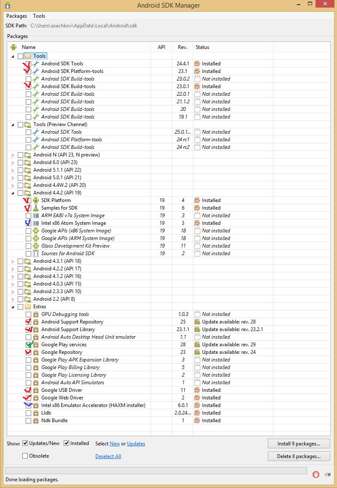

# android-simple

## Preparing for development for Android

1. Download and install [Java](http://www.oracle.com/technetwork/java/javase/downloads/jdk8-downloads-2133151.html)
2. Obtain [Android Studio](http://developer.android.com/sdk/index.html)
    * Check that you have JDK and Android SDK which accessible for Android Studio: use `File -> Project Structure`
    * Check that you have right version of SDK Platform and other tools:
        - Go to `File -> Settings -> Appearance & Behavior -> System Settings`
        - Click `Launch Standalone SDK Manager`
        - Check that you have all packages from screenshot:
            + Red color means this package is required
            + Blue color means this package is required only if you will use emulator
            + Green color means this package is optional
        - 
        - **I will use API Level 19**, but you can select other API Level if you want
    * Check that Android studio found JDK and Android SDK:
        - Go to `File -> Project Structure`
        - Check that paths to JDK and Android SDK is setted:
            + ~[JDK and Android SDK paths](jdksdk.png)
        - __This paths may be different on your computer than on my__
3. Obtain Android device or prepare emulator
    * [GenyMotion](https://www.genymotion.com/)
4. **Check that all works fine**
    * Create new project with `Blank Activity`
    * Run it (`Shift + F10`): on this step may be you will need to configure your device/emulator
        - For real devices you need to enable `Developer mode`:
            + On device go to `Settings -> About device`.
            + Tap on kernel version as many times, as you can) (__minimum 9 times__)
            + After that in Settings will be visible menu for developing
        - Also may be need to install some drivers or PC applications from your phone's vendor (HTC Sync Manger for example) for launching on device
    * If application launched and works it means that you prepared for class

If you have any questions, welcome to [Giiter chat].

Some simple example of Android application will be here later